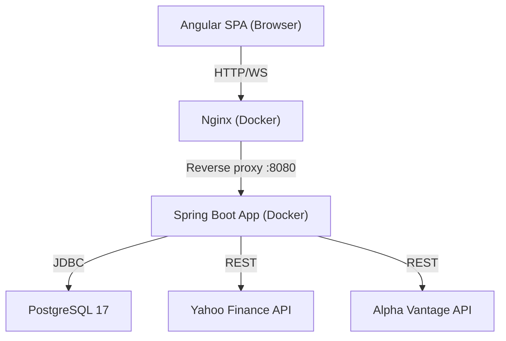
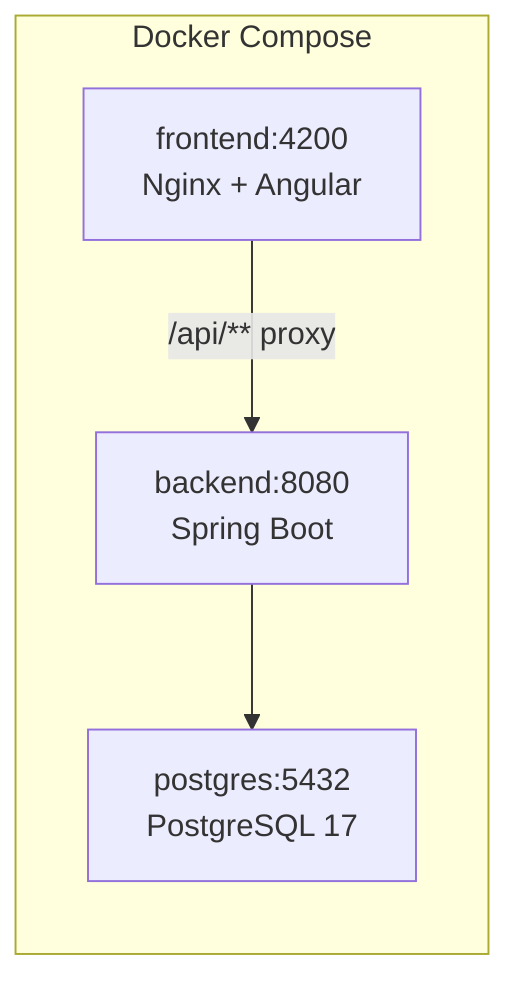
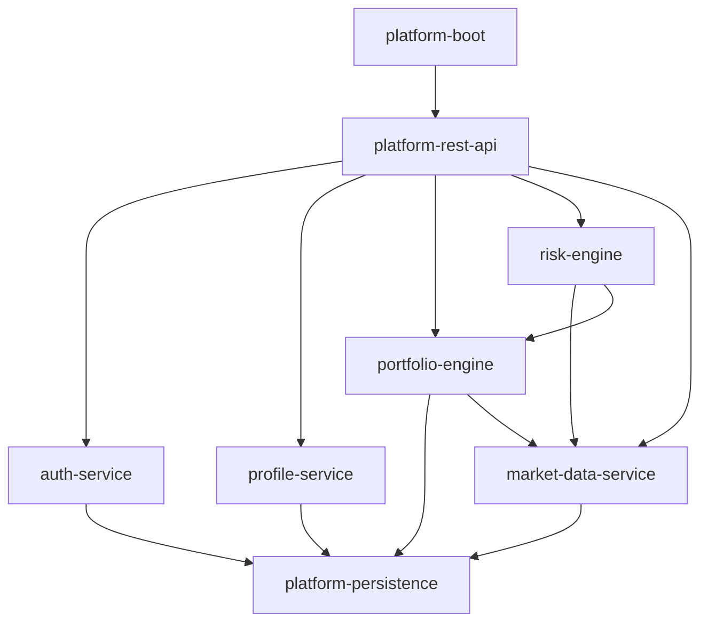
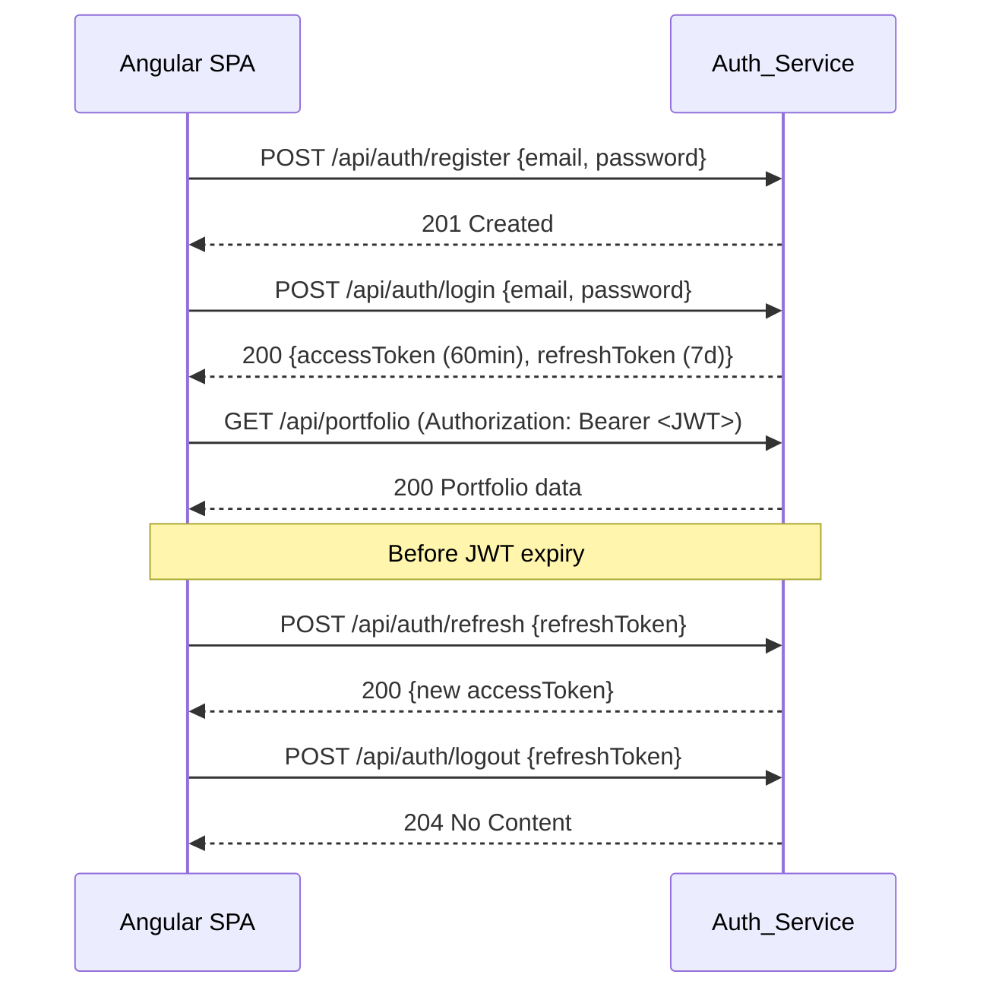
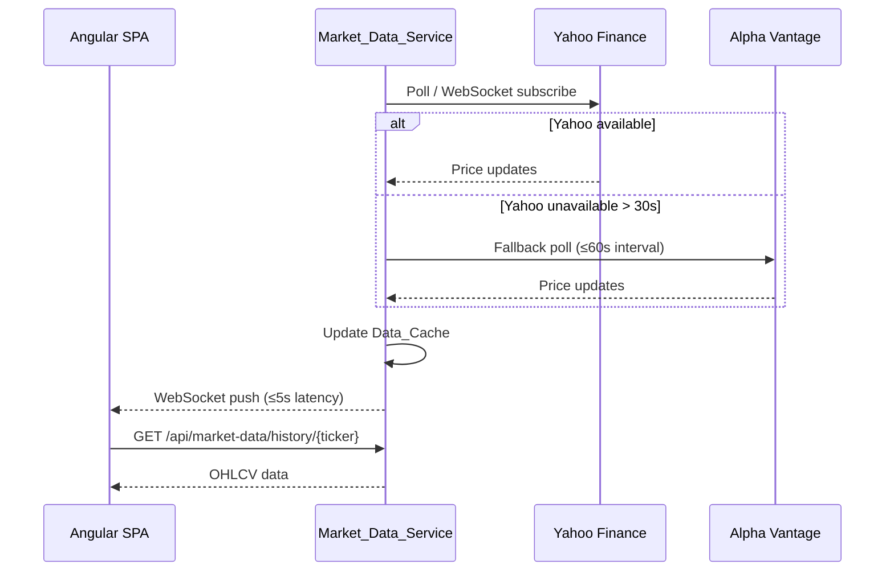

# Design Document: Equity Trading and Investment Portal

## Overview

The Equity Trading and Investment Portal is a full replacement of the existing Angular + Spring Boot platform. It serves retail traders and investors with a guided financial profile wizard, AI-assisted portfolio recommendations across multiple asset classes, derivative overlay proposals for risk management, and live market data feeds.

The system is composed of:
- An Angular 21 (TypeScript) single-page application (SPA) served via Nginx in Docker
- A Java 21 Spring Boot 3.5 multi-module Maven backend, containerised via Docker
- A PostgreSQL 17 database for persistence
- External market data from Yahoo Finance (primary) and Alpha Vantage (fallback)

The backend is decomposed into five domain services, each a Maven module, all assembled into a single deployable Spring Boot application (monolith-first, service-boundary-aware). This avoids the operational overhead of microservices while preserving clean domain separation and a clear migration path.



---

## Architecture

### Deployment Architecture

All services run via `docker-compose.yml` with three containers: `frontend` (Nginx + Angular build), `backend` (Spring Boot fat JAR), and `postgres`.



### Backend Module Structure

The existing modules (`platform-boot`, `platform-dsl-core`, etc.) are replaced with:

| Maven Module | Responsibility |
|---|---|
| `auth-service` | JWT issuance, refresh, logout, bcrypt password hashing |
| `profile-service` | Financial profile CRUD, validation |
| `portfolio-engine` | Portfolio recommendation generation, instrument universe |
| `risk-engine` | Derivative overlay proposals, Black-Scholes pricing |
| `market-data-service` | Market data ingestion, caching, WebSocket distribution |
| `platform-persistence` | JPA entities, repositories, Flyway migrations |
| `platform-rest-api` | REST controllers, WebSocket endpoints, OpenAPI spec |
| `platform-boot` | Spring Boot entry point, wires all modules |



### Frontend Module Structure

The Angular SPA uses standalone components and lazy-loaded feature modules:

```
src/app/
  core/           # Auth interceptor, JWT service, guards
  shared/         # Reusable UI components, pipes
  features/
    auth/         # Login, registration pages
    wizard/       # Financial profile wizard (5 steps)
    dashboard/    # Portfolio + derivative overlay + live prices
    history/      # Historical recommendations
```

### Authentication Flow



### Market Data Flow



---

## Components and Interfaces

### REST API Endpoints

All endpoints are prefixed `/api`. JWT required unless noted.

#### Auth_Service
| Method | Path | Auth | Description |
|---|---|---|---|
| POST | `/api/auth/register` | None | Register new user |
| POST | `/api/auth/login` | None | Login, returns JWT + refresh token |
| POST | `/api/auth/refresh` | None | Exchange refresh token for new JWT |
| POST | `/api/auth/logout` | JWT | Invalidate refresh token |

#### Profile_Service
| Method | Path | Auth | Description |
|---|---|---|---|
| POST | `/api/profile` | JWT | Create financial profile |
| PUT | `/api/profile` | JWT | Update financial profile |
| GET | `/api/profile` | JWT | Retrieve current profile |

#### Portfolio_Engine
| Method | Path | Auth | Description |
|---|---|---|---|
| POST | `/api/portfolio/recommend` | JWT | Generate new recommendation |
| GET | `/api/portfolio/history` | JWT | List historical recommendations (desc) |
| GET | `/api/portfolio/history/{id}` | JWT | Get specific historical recommendation |

#### Risk_Engine
| Method | Path | Auth | Description |
|---|---|---|---|
| GET | `/api/risk/overlay/{portfolioId}` | JWT | Get derivative overlay for a portfolio |

#### Market_Data_Service
| Method | Path | Auth | Description |
|---|---|---|---|
| GET | `/api/market-data/quote/{ticker}` | JWT | Latest quote for ticker |
| GET | `/api/market-data/history/{ticker}` | JWT | OHLCV history (query: from, to) |
| GET | `/api/market-data/reference/{ticker}` | JWT | Reference data for ticker |
| WS | `/ws/market-data` | JWT (handshake) | WebSocket price feed |

### WebSocket Protocol

The frontend connects to `/ws/market-data` using STOMP over SockJS. After connection, it subscribes to `/topic/prices/{ticker}` for each instrument in the active portfolio. The backend publishes `PriceUpdateMessage` objects on each cache refresh.

### Angular Service Interfaces (TypeScript)

```typescript
// auth.service.ts
interface AuthTokens { accessToken: string; refreshToken: string; expiresIn: number; }
login(email: string, password: string): Observable<AuthTokens>
register(email: string, password: string): Observable<void>
refresh(refreshToken: string): Observable<AuthTokens>
logout(): Observable<void>

// portfolio.service.ts
generateRecommendation(): Observable<PortfolioRecommendation>
getHistory(): Observable<PortfolioRecommendation[]>

// market-data.service.ts
getQuote(ticker: string): Observable<MarketDataSnapshot>
subscribeToPrice(ticker: string): Observable<PriceUpdate>
getHistory(ticker: string, from: Date, to: Date): Observable<OhlcvBar[]>
```

---

## Data Models

### Backend JPA Entities (PostgreSQL)

```java
// User account
@Entity class UserAccount {
    UUID id;
    String email;          // unique, indexed
    String passwordHash;   // bcrypt, cost ≥ 12
    Instant createdAt;
}

// Refresh token store (for invalidation on logout)
@Entity class RefreshToken {
    UUID id;
    UUID userId;
    String tokenHash;      // SHA-256 of raw token
    Instant expiresAt;
    boolean revoked;
}

// Financial profile
@Entity class FinancialProfile {
    UUID id;
    UUID userId;           // FK → UserAccount
    RiskTolerance riskTolerance;          // CONSERVATIVE | MODERATE | AGGRESSIVE
    InvestmentExperience experience;      // BEGINNER | INTERMEDIATE | ADVANCED
    IncomeBracket incomeBracket;          // enum bands
    NetWorthBand netWorthBand;            // enum bands
    int horizonMonths;     // 1–360
    Set<RegionalPreference> regions;      // NORTH_AMERICA | EUROPE | ASIA_PACIFIC | GLOBAL
    BigDecimal targetRoiPercent;          // 0.1–50.0
    Instant updatedAt;
}

// Instrument reference data
@Entity class Instrument {
    UUID id;
    String ticker;         // unique
    String isin;
    String name;
    AssetClass assetClass; // EQUITY | BOND | VANILLA_OPTION | SWAP | EXOTIC_OPTION | STRUCTURED_PRODUCT
    String exchange;
    String currency;
    RegionalPreference region;
    Instant lastUpdated;
}

// Portfolio recommendation
@Entity class PortfolioRecommendation {
    UUID id;
    UUID userId;
    Instant generatedAt;
    BigDecimal expectedReturnPercent;
    BigDecimal volatilityPercent;
    List<AllocationLine> allocations;  // @OneToMany
}

@Entity class AllocationLine {
    UUID id;
    UUID portfolioId;
    UUID instrumentId;
    BigDecimal weightPercent;          // sum across portfolio = 100
    BigDecimal priceAtGeneration;
}

// Derivative overlay
@Entity class DerivativeOverlay {
    UUID id;
    UUID portfolioId;
    Instant generatedAt;
    List<DerivativePosition> positions; // @OneToMany
}

@Entity class DerivativePosition {
    UUID id;
    UUID overlayId;
    DerivativeType type;   // PROTECTIVE_PUT | COVERED_CALL | IR_SWAP | EXOTIC_OPTION
    String description;
    BigDecimal estimatedCostPercent;
    BigDecimal maxLossReductionPercent;
    // Black-Scholes inputs (nullable for non-options)
    BigDecimal spotPrice;
    BigDecimal strikePrice;
    BigDecimal impliedVolatility;
    BigDecimal riskFreeRate;
    BigDecimal timeToExpiryYears;
    String notice;         // populated when pricing data unavailable
}

// Market data cache
@Entity class MarketDataSnapshot {
    UUID id;
    String ticker;         // unique (latest snapshot per ticker)
    BigDecimal price;
    String currency;
    Instant timestamp;
    String source;         // YAHOO | ALPHA_VANTAGE | CACHE
    boolean isStale;
    Instant cachedAt;
}
```

### Frontend TypeScript Models

```typescript
interface FinancialProfile {
  riskTolerance: 'conservative' | 'moderate' | 'aggressive';
  experience: 'beginner' | 'intermediate' | 'advanced';
  incomeBracket: string;
  netWorthBand: string;
  horizonMonths: number;
  regions: RegionalPreference[];
  targetRoiPercent: number;
}

interface PortfolioRecommendation {
  id: string;
  generatedAt: string;       // ISO-8601
  expectedReturnPercent: number;
  volatilityPercent: number;
  allocations: AllocationLine[];
  overlay: DerivativeOverlay;
}

interface AllocationLine {
  ticker: string;
  name: string;
  assetClass: string;
  weightPercent: number;
  currentPrice: number;
  currency: string;
  dailyChangePercent: number;
}

interface DerivativeOverlay {
  positions: DerivativePosition[];
}

interface DerivativePosition {
  type: string;
  description: string;
  estimatedCostPercent: number;
  maxLossReductionPercent: number;
  bsInputs?: BlackScholesInputs;
  notice?: string;
}

interface BlackScholesInputs {
  spotPrice: number;
  strikePrice: number;
  impliedVolatility: number;
  riskFreeRate: number;
  timeToExpiryYears: number;
}

interface MarketDataSnapshot {
  ticker: string;
  price: number;
  currency: string;
  timestamp: string;         // ISO-8601
  source: string;
  isStale: boolean;
}
```

### Database Schema (Flyway migrations)

Key constraints:
- `financial_profile.horizon_months` CHECK (1 ≤ x ≤ 360)
- `financial_profile.target_roi_percent` CHECK (0.1 ≤ x ≤ 50.0)
- `allocation_line.weight_percent` CHECK (0 < x ≤ 40)
- `allocation_line` sum enforced at application layer (Portfolio_Engine)
- `refresh_token.expires_at` indexed for cleanup jobs
- `market_data_snapshot.ticker` unique index (upsert on refresh)


---

## Correctness Properties

*A property is a characteristic or behavior that should hold true across all valid executions of a system — essentially, a formal statement about what the system should do. Properties serve as the bridge between human-readable specifications and machine-verifiable correctness guarantees.*

### Property 1: Valid registration succeeds

*For any* unique email address and password of length ≥ 12 characters, submitting a registration request to the Auth_Service should result in a successful account creation response (HTTP 201).

**Validates: Requirements 1.1**

---

### Property 2: Short password rejected

*For any* password string of length 0–11 characters, submitting a registration request should result in HTTP 400 with a descriptive error message.

**Validates: Requirements 1.3**

---

### Property 3: Login returns correctly structured tokens

*For any* registered user, submitting valid credentials should return a JWT with an `exp` claim of exactly 60 minutes from issuance and a refresh token with an expiry of exactly 7 days.

**Validates: Requirements 1.4**

---

### Property 4: Refresh token round-trip

*For any* authenticated user, after a JWT expires, presenting the associated refresh token to the Auth_Service should produce a new valid JWT, and the old JWT should no longer be accepted.

**Validates: Requirements 1.5, 10.5**

---

### Property 5: Invalid credentials return generic 401

*For any* combination of email and password where at least one is incorrect, the Auth_Service should return HTTP 401 with a message that does not distinguish between wrong email and wrong password.

**Validates: Requirements 1.6**

---

### Property 6: Logout invalidates refresh token

*For any* authenticated user, after calling logout, attempting to use the associated refresh token to obtain a new JWT should fail with HTTP 401.

**Validates: Requirements 1.7**

---

### Property 7: Valid financial profile persisted and retrievable

*For any* authenticated user and any valid Financial_Profile (horizon 1–360 months, ROI 0.1–50%, ≥1 region, all required fields present), submitting the profile should return HTTP 201, and a subsequent GET should return the same profile values.

**Validates: Requirements 2.1, 2.6**

---

### Property 8: Out-of-range horizon rejected

*For any* integer value outside the range [1, 360], submitting it as `horizonMonths` in a Financial_Profile should result in HTTP 400 with a descriptive validation error.

**Validates: Requirements 2.2**

---

### Property 9: Out-of-range ROI rejected

*For any* decimal value outside the range [0.1, 50.0], submitting it as `targetRoiPercent` in a Financial_Profile should result in HTTP 400 with a descriptive validation error.

**Validates: Requirements 2.3**

---

### Property 10: Missing required profile fields rejected

*For any* Financial_Profile submission where one or more required fields (risk tolerance, experience, income bracket, net worth band, horizon, regions, target ROI) are absent, the Profile_Service should return HTTP 400.

**Validates: Requirements 2.7**

---

### Property 11: Profile update round-trip

*For any* authenticated user with an existing Financial_Profile, submitting an updated profile with different values should result in HTTP 200, and a subsequent GET should return the updated values (not the original).

**Validates: Requirements 2.5, 2.6**

---

### Property 12: Portfolio recommendation contains required asset classes

*For any* valid Financial_Profile, the generated Portfolio_Recommendation should contain at least one Equity and at least one Bond from the user's selected Regional_Preference(s).

**Validates: Requirements 3.2**

---

### Property 13: Aggressive long-horizon portfolio includes structured product

*For any* Financial_Profile with `riskTolerance = aggressive` and `horizonMonths > 36`, the generated Portfolio_Recommendation should contain at least one Structured_Product.

**Validates: Requirements 3.3**

---

### Property 14: Allocation weights sum to 100%

*For any* generated Portfolio_Recommendation, the sum of all `weightPercent` values across all AllocationLines should equal exactly 100.0%.

**Validates: Requirements 3.4**

---

### Property 15: No single allocation exceeds 40%

*For any* generated Portfolio_Recommendation, no individual AllocationLine should have a `weightPercent` greater than 40.0%.

**Validates: Requirements 3.5**

---

### Property 16: Historical recommendations ordered by timestamp descending

*For any* user with multiple generated Portfolio_Recommendations, the list returned by the history endpoint should be ordered such that each recommendation's `generatedAt` timestamp is greater than or equal to the next one in the list.

**Validates: Requirements 3.8**

---

### Property 17: Derivative overlay is non-empty for any portfolio

*For any* generated Portfolio_Recommendation, the associated Derivative_Overlay should contain at least one DerivativePosition.

**Validates: Requirements 4.1**

---

### Property 18: Vanilla options proposed for large equity allocations

*For any* Portfolio_Recommendation where an Equity instrument has `weightPercent > 10`, the associated Derivative_Overlay should contain at least one Vanilla_Option position referencing that equity.

**Validates: Requirements 4.2**

---

### Property 19: IR swap proposed for bond portfolios with long horizon

*For any* Financial_Profile with `horizonMonths > 12` and a Portfolio_Recommendation containing at least one Bond allocation, the Derivative_Overlay should contain at least one interest rate Swap position.

**Validates: Requirements 4.3**

---

### Property 20: Exotic option included for aggressive risk profiles

*For any* Financial_Profile with `riskTolerance = aggressive`, the Derivative_Overlay should contain at least one Exotic_Option position.

**Validates: Requirements 4.4**

---

### Property 21: Derivative position fields are present and non-negative

*For any* DerivativePosition in a Derivative_Overlay, both `estimatedCostPercent` and `maxLossReductionPercent` should be present and have values ≥ 0.

**Validates: Requirements 4.5, 4.6**

---

### Property 22: Black-Scholes inputs documented for vanilla options

*For any* Vanilla_Option DerivativePosition in a Derivative_Overlay, the `bsInputs` object should be present and contain non-null values for spot price, strike price, implied volatility, risk-free rate, and time to expiry.

**Validates: Requirements 4.8**

---

### Property 23: Market data cache round-trip

*For any* ticker symbol, after the Market_Data_Service successfully fetches and caches a price update, querying the cache for that ticker should return the same price and timestamp that was fetched.

**Validates: Requirements 5.7**

---

### Property 24: Staleness flag set for old market data

*For any* MarketDataSnapshot where the difference between the current time and `timestamp` exceeds 120 seconds, the `isStale` field should be `true`.

**Validates: Requirements 7.8**

---

### Property 25: Wizard back navigation retains values

*For any* wizard state where the user has entered values on step N and navigated to step N+1, clicking Back should return to step N with all previously entered values intact.

**Validates: Requirements 8.4**

---

### Property 26: Wizard pre-populates from existing profile

*For any* authenticated user with a persisted Financial_Profile, opening the wizard should result in all wizard fields being pre-populated with the values from the most recently persisted profile.

**Validates: Requirements 8.7**

---

### Property 27: MarketDataSnapshot serialisation round-trip

*For any* valid MarketDataSnapshot object, serialising it to JSON and then deserialising the resulting JSON back to a MarketDataSnapshot should produce an object equal to the original, and serialising that object again should produce an identical JSON string.

**Validates: Requirements 9.1, 9.2, 9.4, 9.5**

---

### Property 28: Incomplete JSON market data payload rejected

*For any* JSON payload missing at least one of the required fields (`ticker`, `price`, `timestamp`), the REST_API should reject it with a descriptive parse error and should not persist any partial snapshot.

**Validates: Requirements 9.3**

---

### Property 29: Input sanitisation rejects injection patterns

*For any* user-supplied string input containing SQL injection patterns (e.g. `'; DROP TABLE`) or XSS payloads (e.g. `<script>alert(1)</script>`), the backend should either reject the request with HTTP 400 or sanitise the input such that the stored value contains no executable code.

**Validates: Requirements 10.4**

---

### Property 30: Unhandled exceptions return generic 500

*For any* request to the Portfolio_Engine or Risk_Engine that triggers an unhandled exception, the HTTP response should be status 500 with a generic error message (not a stack trace), and the full exception details should be present in the server-side logs.

**Validates: Requirements 10.7**

---

## Error Handling

### Auth_Service
- Registration with duplicate email → 409 Conflict, `{"error": "EMAIL_ALREADY_EXISTS", "message": "..."}`
- Registration with short password → 400 Bad Request, `{"error": "INVALID_PASSWORD", "message": "..."}`
- Invalid credentials → 401 Unauthorized, `{"error": "INVALID_CREDENTIALS", "message": "Invalid email or password"}` (deliberately generic)
- Expired/invalid JWT → 401 Unauthorized, `{"error": "TOKEN_EXPIRED"}`
- Invalid/revoked refresh token → 401 Unauthorized, `{"error": "INVALID_REFRESH_TOKEN"}`

### Profile_Service
- Missing required fields → 400 Bad Request with field-level validation errors
- Out-of-range horizon or ROI → 400 Bad Request with descriptive message
- Empty regions list → 400 Bad Request

### Portfolio_Engine
- No Financial_Profile found → 422 Unprocessable Entity, `{"error": "PROFILE_REQUIRED", "message": "..."}`
- Market data unavailable during generation → proceed with cached data; include `dataWarning` field in response
- Unhandled exception → 500 Internal Server Error, `{"error": "INTERNAL_ERROR", "message": "An unexpected error occurred"}` + server-side log

### Risk_Engine
- Derivative pricing data unavailable → exclude position, include `notice` field in DerivativePosition
- Unhandled exception → 500 Internal Server Error (same pattern as Portfolio_Engine)

### Market_Data_Service
- Primary provider unavailable > 30s → switch to Alpha Vantage, log `WARN`
- Both providers unavailable → serve cache with `isStale: true` and `staleness_timestamp`
- Requested ticker not found → 404 Not Found
- Date range exceeds 5 years → 400 Bad Request

### Global Exception Handler
A Spring `@ControllerAdvice` catches all unhandled exceptions, logs the full stack trace with a correlation ID, and returns a sanitised 500 response. The correlation ID is included in the response body so users can report it.

### Frontend Error Handling
- HTTP 401 → Angular `HttpInterceptor` attempts token refresh; if refresh fails, redirects to login
- HTTP 4xx → display inline error message in the relevant component
- HTTP 5xx → display a global error toast with the correlation ID
- WebSocket disconnect → fall back to 60s polling via REST; display a "Live updates paused" banner

---

## Testing Strategy

### Dual Testing Approach

Both unit tests and property-based tests are required. They are complementary:
- Unit tests verify specific examples, edge cases, and integration points
- Property-based tests verify universal properties across many generated inputs

### Backend Testing (Java)

**Property-Based Testing Library**: [jqwik](https://jqwik.net/) (JUnit 5 compatible, mature PBT library for Java)

Each property-based test must run a minimum of 100 iterations (jqwik default is 1000, which is acceptable).

Each property test must be tagged with a comment referencing the design property:
```java
// Feature: equity-trading-portal, Property 14: Allocation weights sum to 100%
@Property
void allocationWeightsSumTo100(@ForAll("validFinancialProfiles") FinancialProfile profile) {
    PortfolioRecommendation rec = portfolioEngine.generate(profile);
    BigDecimal sum = rec.getAllocations().stream()
        .map(AllocationLine::getWeightPercent)
        .reduce(BigDecimal.ZERO, BigDecimal::add);
    assertThat(sum).isEqualByComparingTo(new BigDecimal("100.00"));
}
```

**Unit Tests** (JUnit 5 + Mockito + AssertJ):
- Auth_Service: duplicate email → 409, bcrypt hash cost verification
- Profile_Service: empty regions → 400, missing fields → 400
- Portfolio_Engine: no profile → 422, market data integration (mocked)
- Risk_Engine: unavailable pricing → notice field populated
- Market_Data_Service: provider failover (mocked HTTP clients), cache staleness

**Property Tests** (jqwik):
- P2: Short password rejected (generate strings length 0–11)
- P3: Login token expiry claims (generate valid user credentials)
- P5: Invalid credentials return generic 401 (generate wrong passwords)
- P8: Out-of-range horizon rejected (generate integers outside [1, 360])
- P9: Out-of-range ROI rejected (generate decimals outside [0.1, 50.0])
- P10: Missing required fields rejected (generate profiles with each field removed)
- P12: Portfolio contains required asset classes (generate valid profiles)
- P13: Aggressive + long horizon includes structured product
- P14: Allocation weights sum to 100%
- P15: No single allocation exceeds 40%
- P16: Historical recommendations ordered descending (generate sequences of recommendations)
- P17: Overlay non-empty for any portfolio
- P18: Vanilla options for equity >10% (generate portfolios with varying equity weights)
- P19: IR swap for bonds + horizon>12 months
- P20: Exotic option for aggressive risk
- P21: Derivative position fields non-negative
- P22: Black-Scholes inputs present for vanilla options
- P23: Cache round-trip (generate random tickers and prices)
- P24: Staleness flag for old snapshots (generate snapshots with varying timestamps)
- P27: MarketDataSnapshot serialisation round-trip (generate random snapshots)
- P28: Incomplete JSON payload rejected (generate payloads with each required field removed)
- P29: Input sanitisation (generate strings with SQL/XSS injection patterns)
- P30: Unhandled exceptions return generic 500 (inject faults via mocks)

### Frontend Testing (Angular / TypeScript)

**Property-Based Testing Library**: [fast-check](https://fast-check.dev/) (mature PBT library for TypeScript/JavaScript)

**Unit Tests** (Jasmine + Karma, or Jest):
- Auth interceptor: token refresh on 401, redirect on refresh failure
- Wizard component: step validation, back navigation retains values
- Dashboard component: staleness banner when `isStale = true`
- Market data service: WebSocket subscription, fallback to polling

**Property Tests** (fast-check):
- P25: Wizard back navigation retains values (generate arbitrary wizard state sequences)
- P26: Wizard pre-populates from existing profile (generate arbitrary FinancialProfile objects)

Tag format for frontend property tests:
```typescript
// Feature: equity-trading-portal, Property 25: Wizard back navigation retains values
it('retains values on back navigation', () => {
  fc.assert(fc.property(arbitraryWizardState(), (state) => {
    // ... test body
  }), { numRuns: 100 });
});
```

### Integration Tests

- Spring Boot `@SpringBootTest` slice tests for each REST controller
- TestContainers for PostgreSQL integration tests
- WireMock for Yahoo Finance and Alpha Vantage HTTP mocking
- WebSocket integration test using Spring's `WebSocketStompClient`

### Test Coverage Targets

- Backend: ≥ 80% line coverage on service and engine classes
- Frontend: ≥ 70% line coverage on service and component classes
- All 30 correctness properties must have corresponding property-based tests
